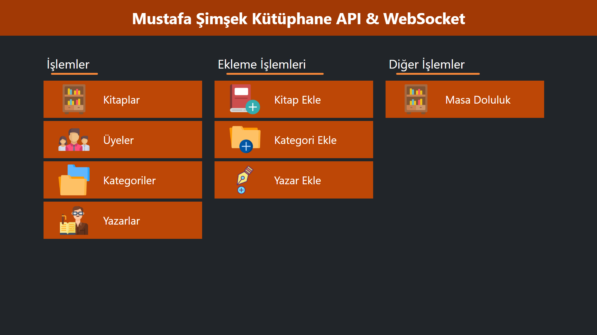

<div align="center">
<h2>Kütüphane Sistemi || PHP REST API & WEBSOCKET</h2>


</div>
<br>
<div align="center">

</div>

<div align="center">


</div>



</br>

# Nedir ?

**Mustafa Şimşek** tarafından versionlar halinde yayınlanacak olan Kütüphane Sistemi Rest API sayesinde (Listeleme-Ekleme-Güncelleme-Silme) isteklerini gönderir
ve gönderilen isteklere tepki vererek istenilen komutların çalışmasına olanak sağlar. PHP'nin Socket Kütüphanesi ``Ratchet Websocket`` aracılığı ile gerçel zamanlı olarak masa doluluk oranlarına erişim sağlayıp masa giriş-çıkış işlemini görüntülemekte yardımcı olur.
\
&nbsp;
# Kullanım Bilgileri !

### Klonla

Kullanmak için öncelikle depoyu klonlamak lazım...

    git clone https://github.com/mustafa-php/kutuphane-sistemi-rest-api-websocket.git
    
komutu ile klonlamanızı tamamlayın

    kutuphane-sistemi-rest-api-websocke/ 
    
klasöründen **server** ve **client** klasörlerini çıkartalım
##

### SERVER klasörü ne işe yarar ?

Rest API yardımı ile verileri alacağımız dosyaları içerir.

### Client klasörü ne işe yara ?

Yönetici ve üye paneli, websocket kütüphanesi ve api isteklerini ileten dosyaları içerir
\
&nbsp;
\
&nbsp;
## Örnek API isteği &rarr; Veri Çekme İsteği &darr; 
```php
file : istek.php

 public function curl($veriler)
    {
        $curl_basla = curl_init();
        curl_setopt($curl_basla, CURLOPT_CUSTOMREQUEST, $veriler["method"]);
        curl_setopt($curl_basla, CURLOPT_POSTFIELDS, json_encode($veriler["veri"]));
        curl_setopt_array($curl_basla, [
            CURLOPT_URL => "https://hostname.com/server/api/api.php",
            CURLOPT_RETURNTRANSFER => 1,
            CURLOPT_SSL_VERIFYPEER => 0,
            CURLOPT_SSL_VERIFYHOST => 0,
        ]);
        $sonuc = curl_exec($curl_basla);
        curl_close($curl_basla);
        return json_decode($sonuc);
    }

 public function get($veri)
    {
        $veriler = [
            "method" => "GET",
            "veri" => $veri
        ];

        return $this->curl($veriler);
    }

```
## Server cevabı &darr;

```json
{
    "icerik": {
        "0": {
            "id": "1",
            "baslik": "Kaval Yelleri",
            "yazar": "Reşat Nuri Güntekin",
            "kategori": "Dram"
        },
        "1": {
            "id": "2",
            "baslik": "Çalı Kuşu",
            "yazar": "Reşat Nuri Güntekin",
            "kategori": "Romantik"
        }
    }
}
```


